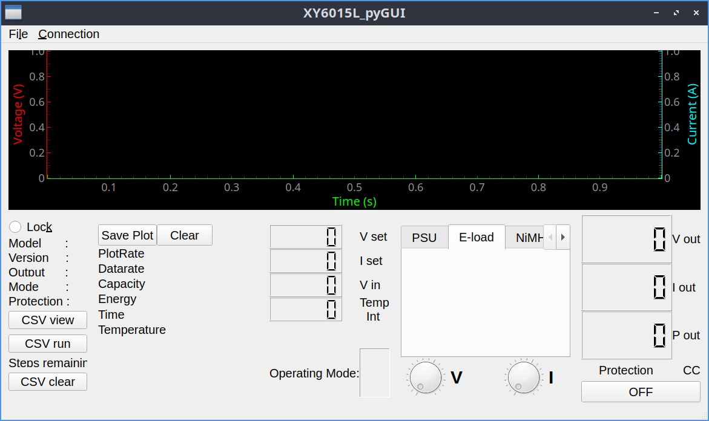
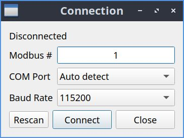

# XY6015L_pyGUI

Cross-platform PyQt5 desktop application for monitoring and controlling an `XY6015L` power supply over Modbus RTU.

## What it does

- Connects to the PSU over a serial Modbus RTU link
- Reads live voltage, current, power, temperature, and status values
- Lets you set voltage and current limits
- Plots live voltage/current data with `pyqtgraph`
- Exports recorded measurements to CSV
- Loads and runs CSV-based automation steps
- Supports basic PSU mode, NiMH/NiCad mode, and Li-Ion/LiPo mode
- Can lock front-panel buttons on supported hardware



## Project status

The core application is Python 3 based and runs from the same source on Linux and Windows.

Platform-specific files in the repository such as:

- `run_program.bat`
- `run_program.sh`
- `install_requirements.bat`
- `install_requirements.sh`
- `build_exe.bat`
- `build_app.sh`

are only helper scripts. They are not the application itself.

The real application entrypoint is:

- `source_files/dps_GUI_program.py`

## Requirements

- Python 3
- `PyQt5`
- `pyserial`
- `MinimalModbus`
- `pyqtgraph`
- `numpy`
- Access to the serial device connected to the PSU

## Recommended setup

Use a local virtual environment inside the repository:

```bash
./install_requirements.sh
```

## Run

From the repository root:

```bash
./run_program.sh
```

If you do not want to use a virtual environment:

```bash
python3 -m pip install -r source_files/requirements.txt
python3 source_files/dps_GUI_program.py
```

## Serial connection

Inside the app:

- open `Connection -> Connection...`
- choose baud rate and slave address
- select a specific port or leave auto-detect enabled
- the current connection dialog is a separate window opened from the top menu

The app can also use a fixed port from:

- `source_files/dps5005_limits.ini`

If no fixed port is set, it scans available serial ports and tries to detect the device automatically.



On Linux, if the PSU is not detected, check permissions for devices such as:

- `/dev/ttyUSB*`
- `/dev/ttyACM*`

## CSV workflow

The application supports two CSV use cases.

1. Automation

Load a CSV file through `File -> Open`, then use `CSV run` to apply the steps to the power supply.

2. Preview

Use `CSV view` to preview loaded CSV data on the graph before establishing a serial connection.

Example files are included:

- `source_files/Sample.csv`
- `source_files/Sample_led.csv`

## Configuration

Main runtime configuration lives in:

- `source_files/dps5005_limits.ini`

This file controls:

- min/max values written to the device
- decimal precision used for register conversion
- graph colors and line widths
- optional fixed serial port

That file is also the main place to adapt the app for similar `DPSxxxx`-style devices.

## Repository layout

- `source_files/dps_GUI_program.py`: main GUI application
- `source_files/dps_modbus.py`: Modbus communication and device wrapper
- `source_files/dps_GUI.ui`: main Qt Designer UI file
- `source_files/connection_dialog.ui`: connection dialog UI
- `source_files/requirements.txt`: Python dependencies
- `XYGUI.spec`: PyInstaller spec file

## Packaging

The repository contains:

- `XYGUI.spec`
- `build_app.sh`

This is the current PyInstaller spec file. It bundles the `.ui` files, icons, and `dps5005_limits.ini`.

To build on Linux:

```bash
./build_app.sh
```

## Safety

You are responsible for safe PSU, battery, and wiring limits.

The application applies configured bounds from `dps5005_limits.ini`, but those bounds still need to match your actual hardware and charging scenario.

---

# XY6015L_pyGUI українською

Кросплатформний застосунок на PyQt5 для моніторингу та керування блоком живлення `XY6015L` через Modbus RTU.

## Що вміє програма

- Підключатися до блоку живлення через serial Modbus RTU
- Читати напругу, струм, потужність, температуру та службові стани
- Задавати обмеження напруги та струму
- Будувати живі графіки напруги і струму через `pyqtgraph`
- Експортувати записані вимірювання в CSV
- Завантажувати і виконувати CSV-сценарії
- Працювати в режимах PSU, NiMH/NiCad та Li-Ion/LiPo
- Блокувати кнопки на пристрої, якщо це підтримується апаратно


## Стан проєкту

Основний застосунок написаний на Python 3 і запускається з одного й того ж коду і в Linux, і у Windows.

Файли на кшталт:

- `run_program.bat`
- `run_program.sh`
- `install_requirements.bat`
- `install_requirements.sh`
- `build_exe.bat`
- `build_app.sh`

це лише допоміжні скрипти. Вони не є ядром програми.

Основна точка входу:

- `source_files/dps_GUI_program.py`

## Залежності

- Python 3
- `PyQt5`
- `pyserial`
- `MinimalModbus`
- `pyqtgraph`
- `numpy`
- доступ до serial-пристрою, до якого підключений блок живлення

## Рекомендоване встановлення

Найкраще використовувати локальне віртуальне середовище в теці репозиторію:

```bash
./install_requirements.sh
```

## Запуск

Із кореня репозиторію:

```bash
./run_program.sh
```

Якщо не хочете використовувати `venv`:

```bash
python3 -m pip install -r source_files/requirements.txt
python3 source_files/dps_GUI_program.py
```

## Підключення по serial

У самій програмі:

- відкрийте `Connection -> Connection...`
- виберіть baud rate і slave address
- виберіть конкретний порт або залиште auto-detect
- діалог підключення відкривається окремим вікном із верхнього меню

Також можна зафіксувати порт у:

- `source_files/dps5005_limits.ini`

Якщо фіксований порт не заданий, програма сканує доступні serial-порти і пробує знайти пристрій автоматично.


У Linux, якщо пристрій не знаходиться, перевірте доступ до портів на кшталт:

- `/dev/ttyUSB*`
- `/dev/ttyACM*`

## Робота з CSV

Програма підтримує два основні сценарії роботи з CSV.

1. Автоматизація

Завантажте CSV через `File -> Open`, після чого використайте `CSV run`, щоб виконати кроки на блоці живлення.

2. Попередній перегляд

Кнопка `CSV view` дозволяє переглянути завантажені дані на графіку до встановлення serial-з’єднання.

Приклади файлів уже є в репозиторії:

- `source_files/Sample.csv`
- `source_files/Sample_led.csv`

## Конфігурація

Основний runtime-конфіг лежить тут:

- `source_files/dps5005_limits.ini`

У цьому файлі задаються:

- мінімальні і максимальні значення, які можна писати в пристрій
- десяткові розряди для перетворення регістрів
- кольори графіків і товщина ліній
- опціональний фіксований serial-порт

Це також головне місце для адаптації програми під схожі пристрої серії `DPSxxxx`.

## Структура репозиторію

- `source_files/dps_GUI_program.py`: головний GUI-застосунок
- `source_files/dps_modbus.py`: Modbus-комунікація і обгортка над пристроєм
- `source_files/dps_GUI.ui`: головний інтерфейс із Qt Designer
- `source_files/connection_dialog.ui`: діалог підключення
- `source_files/requirements.txt`: Python-залежності
- `XYGUI.spec`: файл збірки PyInstaller

## Збірка

У репозиторії є:

- `XYGUI.spec`
- `build_app.sh`

Цей `spec`-файл використовується для збірки через PyInstaller і включає `.ui` файли, іконки та `dps5005_limits.ini`.

Для збірки в Linux:

```bash
./build_app.sh
```

## Безпека

Ви самі відповідаєте за безпечні значення для блоку живлення, акумуляторів і підключення.

Програма використовує обмеження з `dps5005_limits.ini`, але вони все одно мають відповідати вашому реальному обладнанню і сценарію використання.
